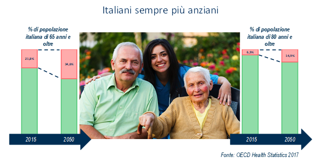
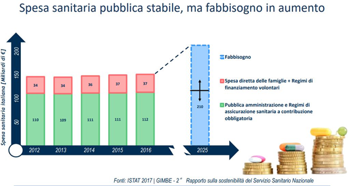

.. _h685a187f59142f205b35575962684558:

4. Politiche verticali per la sostenibilità 
############################################

 

.. _h315152633d136a49434620d35513e3a:

4.1 Sanità 
***********

La sostenibilità del nostro Sistema Sanitario e, soprattutto, il suo carattere universalistico sono messe alla prova dalla divaricazione tra risorse disponibili e bisogni dei cittadini.  

Nei prossimi anni l’invecchiamento demografico e l’aumento della speranza di vita faranno lievitare la domanda di assistenza e cura: con il 21,8% dei cittadini over 65 e il 6,5% over 80, l’Italia è il Paese più vecchio in Europa, e si posiziona al secondo posto nel mondo, preceduto solo dal Giappone. La bassa natalità è destinata a peggiorare la situazione: si prevede che nel 2050 gli anziani sopra i 65 anni saranno il 34,6% della popolazione, mentre gli ultraottantenni raggiungeranno quota 14,9%. A ciò si aggiunge che l’aspettativa di vita in buona salute all’età di 65 anni in Italia è tra le più basse nei paesi OCSE, con 7,5 anni senza disabilità per le donne e circa 7,8 anni per gli uomini.  

\ |IMG1|\  

A fronte di questo la spesa sanitaria pubblica, negli ultimi anni, è stata praticamente stabile, ma è cresciuta la componente a carico delle famiglie: nel 2016 in Italia sono stati spesi circa 150 miliardi di euro per la Sanità, di cui circa 112 a carico del Sistema Sanitario Nazionale e 37 di “out of pocket” e a carico di assicurazione private. Si tratta di una cifra complessiva apparentemente enorme, ma in realtà moderata se rapportata al PIL e confrontata con altri Paesi europei: infatti, rappresenta “appena” l’8,9% del reddito nazionale, una percentuale decisamente inferiore a quella di altri Paesi come Germania (11,3%), Francia (11%) e Regno unito (9,7%). Occorre, inoltre, sottolineare che tale spesa è stata pressoché stabile negli ultimi anni (nel 2012 la spesa complessiva era di 144,5 miliardi, di cui 34 privata) ma che la spesa out of pocket ha aumentato la sua incidenza sul totale. Se, come risulta da stime recenti, la spesa sanitaria nazionale dovesse salire nel 2025 a 210 miliardi di euro, una larga parte degli ulteriori 60 miliardi necessari a coprire tale fabbisogno potrebbe essere a carico delle famiglie: molte di esse, anche nel cosiddetto ceto medio, si troverebbero nella sostanziale impossibilità di accedere alle cure, producendo fenomeni preoccupanti di disuguaglianza e degrado sociale. I dati Eurostat relativi al 2016 mostrano, infatti, come oltre il 20% della popolazione abbia avuto difficoltà elevata o moderata nel permettersi le cure. 

\ |IMG2|\  

Per rispondere a questi fenomeni di radicale cambiamento del quadro sociale e epidemiologico, nella scorsa legislatura, sono state messe in campo iniziative come il Piano Nazionale della Cronicità (PNC) e il Decreto sui nuovi Livelli essenziali di assistenza (LeA). All’interno del Piano triennale per l'Ecosistema Sanità sono stati evidenziati tre progetti a titolo esemplificativo: Fascicolo Sanitario Elettronico, come esempio di infrastruttura abilitante; Centro unico di prenotazione (CUP), da realizzare su tutto il territorio nazionale per favorire l’accesso alle cure e la riduzione dei tempi di attesa; Telemedicina, per migliorare la fruibilità delle cure, dei servizi di diagnosi e della consulenza medica a distanza. Per la riduzione del rischio clinico è stata approvata la \ |STYLE0|\ . 

Questi interventi normativi, da soli, non servono a ridurre il forte divario tra risorse disponibili e bisogni crescenti della popolazione. Quello che si rende necessario è un processo di innovazione dei processi del SSN, pena il peggioramento della qualità dei servizi sanitari, come segnala l’ultimo rapporto \ |STYLE1|\ , in cui l’Italia è passata, tra il 2010 e il 2017, dal 14° al 22° posto delle 35 nazioni censite a livello europeo per performance del sistema sanitario. 

| 

.. _h1f6b4db4b78746b3e8068553c2c7238:

Rinnovamento organizzativo e tecnologico del SS 
================================================

Enti centrali, regioni, Aziende sanitarie sono attori chiave nel determinare le scelte di rinnovamento del SSN. Dopo anni di spinte innovatrici isolate e legate a singole personalità, produttrici di eccellenze ma non di pratiche diffuse, dobbiamo registrare un aumento della consapevolezza tra i decisori pubblici (a livello centrale e territoriale) circa la necessità e l’urgenza di una risposta in termini di sistema. Per l’efficacia di questa risposta è necessario chiarire bene ruoli di Ministero, regioni e Aziende sanitarie in una governance con livelli diversi, irrinunciabili, cooperativi nella costruzione di sistemi sanitari regionali orientati all’efficienza, alla qualità dell’assistenza sanitaria e all’innovazione come volano di sviluppo economico. Governo e regioni devono provare a raccordare le politiche, condividere obiettivi, linee guida da trasferire alle Aziende sanitarie. Esse devono essere il vero motore del cambiamento, in funzione della prossimità con i bisogni dei cittadini e degli operatori sanitari. Legittimando e valorizzando (un primo passo è stato fatto con l’Albo dei DG) una classe dirigente, che ha garantito flessibilità e capacità di gestione negli anni più duri del SSN (2010-2015); che sarà essenziale per gestire aziende che diventano sempre più grandi e complesse. 

Rinnovamento organizzativo e innovazione tecnologica rappresentano fattori abilitanti fondamentali per la risposta ai nuovi bisogni di salute dei cittadini e per la sostenibilità del SSN. Per cronicità, disabilità, salute mentale, assistenza domiciliare è il SSN che deve prendersi cura del cittadino, riducendo disuguaglianze e difficoltà di accesso ai servizi, assicurando una risposta integrata e duratura. L’innovazione tecnologica è da sostenere con un piano nazionale di investimenti come i fondi per l’Art. 20 della legge n. 67/88, sostenuto però da un sistema di valutazione dei progetti e controllo nell’utilizzo dei fondi più stringente e che premi le regioni capaci. Un’attività di misurazione della qualità dell’assistenza resa ai cittadini, della sostenibilità delle cure, dell’equità di accesso alle cure che sempre più deve diventare uno standard del nostro Servizio sanitario nazionale nelle componenti economico – gestionale, organizzativa, finanziaria e contabile, nonché clinico – assistenziale, di efficacia clinica e dei processi diagnostico – terapeutici, della qualità, sicurezza ed esito delle cure e della trasparenza dei processi. 

La tecnologia (con \ |STYLE2|\ ) sarà lo strumento per mettere a frutto tutte le informazioni e i dati a disposizione. Le persone che devono essere assistite e curate in questo senso diventano fornitori di informazioni utili al rinnovamento dell’organizzazione del SSN. 

Tecnologia e organizzazione sono leve fondamentali anche per innovare la logistica sanitaria, da tempo considerata la chiave per migliorare le prestazioni erogate; per contribuire all'efficienza delle nostre strutture sanitarie; per garantire sicurezza a pazienti e operatori. La chiave per rispondere a questi bisogni è da riscontrarsi in: 

#. \ |STYLE3|\ , perché diventino asset strategici di sviluppo, anche economico. Attraverso \ |STYLE4|\  logistici esterni e una rete operativa interna; gestione terziarizzata; delocalizzazione in aree idonee; micrologistica, che introduce sistemi gestionali di controllo del flusso magazzino di reparto/somministrazione; 

#. \ |STYLE5|\  dei professionisti e degli operatori, in grado di garantire la governance del processo attraverso indicatori di performance e c\ |STYLE6|\ , con la certezza che l’innovazione logistica sia una grande occasione di contrasto al rischio clinico, che si genera in ospedale; 

#. \ |STYLE7|\  con la condivisione reale e la gestione sicura dei dati e delle informazioni; i sistemi identificativi. 

Alcune regioni hanno realizzato delle esperienze interessanti per alcune fasi del processo logistico, altre hanno definito un percorso progettuale, altre hanno preso atto delle realizzazioni più o meno integrali messe in essere da alcune aziende sanitarie locali/ospedali di punta del loro territorio. Non ci sono, allo stato attuale degli atti, provvedimenti che stabiliscano su scala nazionale indirizzi per costituire soluzioni di logistica sanitaria in ambito regionale. 

Sussiste la necessità di definire criteri, standard, indicatori che assicurino che: 

* la logistica sanitaria sia una funzione dell'ospedale e, più complessivamente, dell'azienda sanitaria locale; 

* la logistica sanitaria assicuri il raggiungimento di uniformi livelli di servizio nel magazzino centrale e cooperi al conseguimento dei livelli di servizio in ambito ospedaliero; 

* l'investimento necessario da parte del partner privato per la struttura e l'infrastruttura avvenga sulla base di dati tecnico-amministrativi certi. 

.. admonition:: Raccomandazione 4.1a - Spostare le cure dall’ospedale al territorio e definire processi di presa in carico dei sempre più numerosi pazienti cronici

    È necessario costruire un modello di presa in carico in cui l'azienda sanitaria svolga un ruolo di regia e integrazione tra gli attori che operano con il cittadino, utilizzando le tecnologie per il telemonitoraggio, la telemedicina, la teleassistenza. Un sistema informatizzato regionale deve essere integrato con le iniziative socio-assistenziali. Altro tema importante è quello dell'assistenza domiciliare integrata, per cui è essenziale mettere in rete i care-giver, anche informali (badanti) e curarne la formazione, potenziare le equipe territoriali e il ruolo dell’infermiere di territorio. 

 

.. admonition:: Raccomandazione 4.1b - Realizzare applicazioni per valorizzare il flusso di informazioni che il SSN produce quotidianamente

    Il patrimonio di dati preziosissimi destinati a crescere per mole e rilevanza rischia a causa 
    della digitalizzazione ancora parziale e disomogenea del SSN di rilevarsi nei fatti non disponibile o inutilizzabile. In questo modo si penalizza l’appropriatezza terapeutica e si agisce con ritardo e poca incisività su sprechi e possibili abusi. I dati ci servono per 
    migliorare le performance ed il modello di funzionamento degli Enti del SSN. 
    Sarà opportuno: 
    
    * Stabilire policy di data governance per avere dati di qualità; 
    
    * creare un mix di competenze, favorendo la cooperazione strutturata di \ |STYLE8|\  con i leader del cambiamento, i \ |STYLE9|\  e gli esperti di dominio. 
    

 

.. admonition:: Raccomandazione 4.1c - Semplificare il procurement dell’innovazione digitale

    La spesa digitale in Sanità è frammentata e cresce con lentezza. Le complicazioni introdotte dalle norme sulla trasparenza, dal nuovo codice degli appalti, dalla scarsa conoscenza di strumenti di acquisto innovativi (Procedure competitive con negoziazione, nuovo dialogo competitivo, partenariato per l’innovazione) da parte delle funzioni aziendali responsabili, ha prodotto una burocrazia difensiva che, di fronte a troppe norme non definite, si astiene dal prendere decisioni che possano comportare rischi. Tali vincoli normativi sono incompatibili con chi deve erogare servizi sanitari e con il mandato delle Direzioni aziendali. Pertanto è necessario: 
    
    * Diffondere l’uso intelligentemente delle convenzioni Consip: SGI e SPC; 
    
    * far precedere le gare Consip da una fase di analisi dei fabbisogni contestualizzata sui processi standardizzabili in modo da creare le condizioni per un utilizzo uniforme/focalizzato delle convenzioni; 
    
    * creare un catalogo delle soluzioni e Certificazione soluzioni (Ministero della Salute, AGID, IASO, FederSanità, Agenas, ASSINTER, UniIndustria, Confindustria Digitale); 
    
    * realizzare un Osservatorio nazionale dei prezzi; 
    
    * sviluppare competenze all’interno delle Centrali acquisti (ma anche all’interno di 
    
    * regioni, ASL, AO, AOU) e favorire l’integrazione tra le figure preposte nelle organizzazioni all’innovazione con la funzione acquisti; 
    
    * redigere manuali operativi per indicare come si utilizzano gli strumenti di \ |STYLE10|\  innovativo (sottoporre proposta ad ANAC e Corte dei Conti). 

 

.. admonition:: Raccomandazione 4.1d - Definire piani di indirizzo di logistica sanitaria

    La definizione di tali piani dovrà tradursi, nell’ambito nazionale, in: 
    
    * Definizione di un apposito piano indirizzi (ad integrazione di quelli vigenti per il SSN) per prevedere \ |STYLE11|\  logistici, esterni all'ospedale, in ciascuna regione, aventi livelli di servizio coerenti con la fruizione dei beni trattati (ad esempio, tempo massimo di percorrenza dall'\ |STYLE12|\  all'ospedale, magazzino sanitario dedicato, modalità della scorta unica, ecc.); 
    
    * disciplinare le forniture ospedaliere di farmaci per dosi unitarie; 
    
    * determinare nella legge di bilancio 2018 le risorse economiche dedicate alla realizzazione di hub logistici sanitari e l'allestimento di infrastrutture di rete ad alta velocità connesse. 
    
    Per l'ambito regionale, invece, in: 
    
    * una programmazione specifica di ciascuna Regione (quale strumento di affiancamento della programmazione sanitaria) di insediamento degli \ |STYLE13|\  dedicati alla sanità, prevedendone uno per 1,5 milioni di abitanti od area vasta subregionale o bacino regionale; 
    
    * la definizione di alcune caratteristiche generali dell'hub: tipologia di gestionale informatico, integrazioni con l'ambito economico-contabile e quello clinico-documentale, servizio di convalida e di vigilanza della Farmacia ospedaliera, estensione o meno all'ambito di preparazione di farmaci, ecc.; 
    
    * formulare le varie modalità giuridiche di realizzazione degli hub, anche a seguito di soluzioni di PPP od altre partecipazioni di operatori privati; 
    
    * definire la misura, come i livelli minimi di logistica sanitaria, di alcuni indicatori ormai consolidati nell'esperienza logistica, quali l'indice di rotazione delle scorte, la giacenza media di magazzino, ecc. distintamente per tipologia di bene. 

 

 

.. admonition:: Raccomandazione 4.1e - Costruire rapporto di fiducia tra cittadini e enti della sanità

    Il cittadino deve essere sempre più al centro del SS, attivo e partecipe nella corretta gestione della propria salute. Anche in questo ambito il digitale può giocare un ruolo fondamentale. 
    
    Riguardo l’accesso ai servizi, sarà indispensabile: 
    
    * attuare un approccio multicanale, tradizionale e digitale (incrementare la diffusione di SPID, attraverso la consegna di credenziali presso le strutture di cura o indagine diagnostica); 
    
    * semplificare l’accesso reso difficile da interpretazione rigida e formale della protezione dei dati personali; 
    
    * adottare tecnologie il più possibile simili a quelle d’uso comune (come le App); 
    
    * accelerare il processo di diffusione del FSE (con PDTA integrati) 
    
    Riguardo la comunicazione, invece: 
    
    * spostare la comunicazione circa i servizi offerti e la prevenzione dai siti internet degli enti agli strumenti che i cittadini ritengono propri (social network), garantendo la sicurezza e la privacy dei dati personali contenuti nei profili-utente e un approccio più trasparente nell’indicare le informazioni di accesso ai servizi; 
    
    * profilazione degli assistiti (cfr. raccomandazione dati) per personalizzare l'informazione, la comunicazione e i canali. 

 

| 

.. _h6e6c6a5d7a61c6a127701957787b7:

4.2 Lavoro e occupazione 
*************************

I dati ISTAT mostrano che un tasso di occupazione al 58%, il livello più alto dal 2009, pur "rimanendo 0,7 punti al di sotto del picco del 2008", il valore massimo pre-crisi. Lo stesso discorso vale per il numero di occupati, che sono risultati 23 milioni e 23 mila (con una crescita dell'1,2%, ovvero 265 mila persone in più al lavoro). L'aumento della presenza al lavoro "per il secondo anno consecutivo coinvolge anche i giovani di 15-34 anni, fascia di età in cui gli occupati sono saliti di 45mila unità (+0,9%). Aumentano soprattutto i posti di lavoro a tempo determinato e sono ancora grandi le distanze tra le aree del Paese: Nord, Centro e Sud mostrano infatti tutti un'occupazione in recupero, tuttavia mentre nel Centro-Nord il tasso di occupazione raggiunge livelli pressoché analoghi a quelli del 2008, arrivando al 66,7% nel Nord e 62,8% nel Centro, nel Mezzogiorno l'indicatore è ancora al di sotto del 2008 di 2,0 punti (44,0%). Il tasso di disoccupazione è sceso nel 2017 di 0,5 punti percentuali, dall'11,7% all'11,2% dell'anno precedente: si tratta del livello più basso dal 2013. Calano anche gli inattivi (coloro che non cercano né hanno occupazione). La discesa della disoccupazione "è più forte per i più giovani in confronto ai 35-49enni mentre per gli ultra 50enni aumenta sia il numero di disoccupati sia il tasso di disoccupazione". 

.. admonition:: Raccomandazione 4.2a - Favorire un ecosistema che leghi tutti i diversi attori delle politiche per il lavoro, agevolando la nascita di “Reti locali per l’occupabilità” e l’integrazione pubblico-privato

    E’ fondamentale garantire alle persone un ecosistema che offra perpetue opportunità di apprendimento, competenze, abilità, etc. Entrano in campo una serie di soggetti, non solo il settore pubblico che può agire in questa filiera, ma anche i privati. Si coinvolgono non solo le agenzie per il lavoro ma tutta la filiera del lavoro che è anche la filiera formativa (pubblica e privata). Uno scenario complesso, dove deve esserci collaborazione, nel senso di ripartizione e integrazione delle competenze. Si devono favorire solide integrazioni tra scuola, università, imprese, centri e agenzie per l’impiego, fondi interprofessionali, che sono ancora agli albori.  

 

| 

.. _h2161254f576355517d295d64918671:

Occupazione giovanile 
======================

Secondo Eurostat, nel 2017 i NEET italiani (\ |STYLE14|\ ) sono il 25,7%, dieci punti sopra la media europea che è pari al 14,3%. Emergono differenze tra le diverse aree del Paese: secondo ISTAT, infatti, i NEET sono il 17% al Nord, il 20,4% al Centro e il 34,2% nel Mezzogiorno. La crisi ha profondamente cambiato anche l’incidenza dei NEET con riferimento al livello di istruzione: se, infatti, nel 2008 questi erano maggiormente diffusi fra i giovani con solo la licenza media, negli anni della crisi la crescita ha riguardato principalmente giovani con medio e alto titolo di studio. Oggi l’incidenza dei NEET è simile sia per i giovani con licenza media (22,7%) sia per quelli con diploma o laurea (22,9%), mentre è significativamente superiore per chi ha un diploma di scuola superiore (26,1%). 

L’ANPAL ha provveduto a istituire il nuovo “Incentivo Occupazione Giovani” per promuovere l’occupazione dei NEET di età compresa tra i 16 e i 29 anni che hanno aderito al programma. Si tratta di una misura rivolta ai datori di lavoro che effettuino assunzioni di giovani da gennaio 2017 a dicembre 2018, con contratto a tempo indeterminato (anche \ |STYLE15|\ ), contratto di apprendistato professionalizzante o contratto a tempo determinato della durata di almeno 6 mesi. Le risorse stanziate ammontano a circa 200 milioni di euro e sono indirizzate a tutto il territorio nazionale, ad eccezione della Provincia Autonoma di Bolzano. A fine giugno 2017 le domande presentate erano state quasi 50.000, di cui oltre il 60% sono state confermate. 

Con il Decreto 21 novembre 2016, il Ministero del Lavoro e delle Politiche Sociali ha previsto un conguaglio contributivo per i datori di lavoro che, nel corso del 2017, senza esservi tenuti, assumano giovani di età compresa tra i 15 e i 24 anni, o alternativamente soggetti di età superiore ai 25 anni privi d'impiego regolarmente retribuito da almeno 6 mesi. La sede di lavoro deve essere localizzata in una delle regioni del Sud e il rapporto di lavoro deve necessariamente essere instaurato attraverso un contratto a tempo indeterminato o di apprendistato professionalizzante. 

.. admonition:: Raccomandazione 4.2b - Riformare i centri per l’impiego

    I centri pubblici per l’impiego non devono svolgere un compito burocratico, ma fare tutto ciò che può essere funzionale alla persona. Si devono praticare le politiche del lavoro osservando i bisogni della persona. Un soggetto dedicato non tanto e non solo all’incontro domanda offerta, quanto all’orientamento e collocamento mirato, alla formazione, al reskilling della persona mirato a una soluzione lavorativa.  

 

.. admonition:: Raccomandazione 4.2c - Introdurre l’assegno di ricollocamento, come strumento sistemico e non come intervento di nicchia

    Questo è uno strumento delineato all’interno del Jobs Act, in fase di sperimentazione in Regione Lombardia. E’ lo strumento con cui la persona che è disoccupata o inoccupata sceglie liberamente il servizio al quale rivolgersi e questo viene remunerato almeno in parte sulla base del risultato. Obiettivo dell’assegno: dare impulsi competitivi all’offerta di servizi, spezzare l’autoreferenzialità che ha spesso caratterizzato molti servizi (soprattutto pubblici) e creare un contesto di positiva concorrenza per meglio soddisfare l’aspettativa di occupazione. 

 

| 

.. _h6d1a703f2337155e1142b4b15593f3:

4.3 Città e territori 
**********************

Con l’approvazione della \ |LINK1|\  presentata al Consiglio dei Ministri il 2 ottobre 2017 e approvata dal CIPE il 22 dicembre 2017, le politiche urbane sono tarate in chiave di innovazione e sostenibilità. L’ \ |LINK2|\  proposta da ASviS, Urban@it e ANCI collega i 17 SDGs alle attività delle amministrazioni locali e di governo. Il documento contiene gli obiettivi che le aree urbane devono raggiungere per attuare la Strategia Nazionale e le politiche necessarie, che dovranno diventare parte integrante dell’Agenda urbana nazionale. Al tema della sostenibilità si collega, quindi, la \ |STYLE16|\ . 

 

Sul tema delle risorse a disposizione delle città e del territorio, fa fede il \ |STYLE17|\  cui afferiscono 892,9 milioni di euro della politica di coesione, e il cosiddetto \ |STYLE18|\  pubblicato nel maggio del 2016. Tra i soggetti beneficiari del bando, oltre ai comuni capoluogo, anche le Città metropolitane, enti di recente istituzione e quindi chiamate per la prima volta ad agire nelle politiche di rigenerazione urbana, intesa come politica di area vasta. L'intervento arriva a mobilitare quasi 4 miliardi di euro complessivi. A questo si aggiungono i 16 Patti per il Sud: uno per ognuna delle 8 Regioni (Abruzzo, Molise, Campania, Basilicata, Puglia, Calabria, Sicilia, Sardegna), uno per ognuna delle 7 Città Metropolitane (Napoli, Bari, Reggio Calabria, Messina, Catania, Palermo, Cagliari) e il Contratto Istituzionale di Sviluppo (CIS) di Taranto. I Patti declinano concretamente gli interventi che costituiscono l’asse portante del Masterplan per il Mezzogiorno. 

 

| 

.. _h2e8029376a5f1c5546583b5635231:

Coordinamento centro-periferia  
================================

Un passaggio necessario è quello di ripensare l’agenda delle priorità della politica pubblica nazionale, dedicando più attenzione al territorio, alle città, ai comuni e alle forme di collaborazione civica e pubblica. In particolare, è necessario che si sostengano i comuni sul piano della programmazione, della progettazione degli interventi e della previsione di politiche ideali di cambiamento, con particolare attenzione alle aree più degradate e alle periferie.  

Rendere i Comuni, in particolare quelli piccoli e medi, sempre più in grado di rispondere alle sfide globali che ricadono sui contesti urbani e rurali, riducendo i divari e attraendo nuove energie e nuovi residenti, rappresenta l’elemento di fondo da cui far ripartire l’intero governo del territorio su basi istituzionali più solide. Per questo motivo uscire dalla logica di smart city riservata solo alle grandi città, puntando a rendere più efficienti e dinamiche anche le piccole realtà può diventare la chiave di volta di un cambiamento strategico, a patto che si riparta dalle esigenze reali dei cittadini in termini di accesso a servizi e spazi di qualità. 

.. admonition:: Raccomandazione 4.3a - Adottare un’Agenda urbana nazionale che assuma la forma di un patto tra amministrazione centrale e autorità urbane e che tenga conto dei risultati e dei temi emersi dall’azione delle città su scala nazionale ed europea

    L’Agenda urbana nazionale dovrebbe: essere uno strumento concreto attraverso il quale perseguire obiettivi di grande impatto e interesse pubblico e avere al centro i temi della sostenibilità come proposto dall’“\ |LINK3|\ ” elaborata da ASviS, Urban@it e ad ANCI, che individua gli obiettivi che le aree urbane devono raggiungere per attuare la \ |LINK4|\  e le politiche necessarie. La definizione di una Agenda urbana nazionale che si componga dei risultati e dei temi più significativi emersi dall’azione delle città su scala nazionale ed europea costituisce il punto di partenza per una vera multilevel governance, capace di mettere in rete risorse e competenze dal livello centrale fino a quello locale. Dare continuità al lavoro progettuale delle città facilitando l’utilizzo di quella cassetta degli attrezzi in materia di politiche urbane che l’Europa si prepara a razionalizzare in vista della prossima politica di coesione rappresenta anche un presupposto fondamentale per dare realmente valore all’azione di quel centinaio di città pioniere, che grazie al Piano Periferie, a URBACT e Urban Innovative Actions negli ultimi anni hanno sperimentato modalità di rilancio urbano partecipato che possono fare da modello anche a tanti contesti di piccole e medie dimensioni. 

 

.. admonition:: Raccomandazione 4.3b - Individuare un punto di riferimento all’interno dell’amministrazione centrale che abbia il compito di coordinare le politiche per le città e di definire l’Agenda urbana nazionale

    Quest’ultimo punto fa parte dei \ |LINK5|\  che sono stati \ |LINK6|\  del Paese. 

 

.. admonition:: Raccomandazione 4.3c - Recuperare e sviluppare l’esperienza del Bando periferie

    Bisogna rendere stabili misure di finanziamento che, ad oggi, sono state straordinarie, andando verso un programma ordinario per le zone maggiormente vulnerabili delle città: un “Piano strategico per le città italiane” di carattere pluriennale. Si deve superare la logica dei bandi, prevedendo un meccanismo di finanziamento continuativo, premessa indispensabile per dare continuità al lavoro di progettualità delle città.  

 

.. admonition:: Raccomandazione 4.3d - Costituire una Commissione bicamerale per le città e le periferie, come proposto dalla Commissione d’inchiesta parlamentare sulla condizione delle periferie urbane

    L’obiettivo è passare dalla straordinarietà della Commissione d’inchiesta all’ordinarietà di una Commissione che diventi il luogo dove si esaminano provvedimenti, si acquisiscono pareri, si sviluppano proposte. È un po’ il ruolo che ha la Commissione bicamerale per le questioni regionali, quindi si tratterebbe di affiancare a questo strumento già esistente uno strumento nuovo sul tema delle città e delle periferie. 

 

.. admonition:: Raccomandazione 4.3e - Realizzare una Strategia per le aree urbane

    Riprendere la logica della \ |LINK7|\  avviata nel settembre 2012 dall’allora Ministro per la Coesione Territoriale Fabrizio Barca con il supporto di un Comitato Tecnico Aree Interne costituito allo scopo. Obiettivo della Strategia: garantire l'accessibilità a servizi essenziali, quali istruzione, mobilità e sanità, nei territori interni rurali e prevede per ciascuna area-progetto una strategia di sviluppo con una serie di interventi da attuare attraverso un Accordo di Programma Quadro (APQ). Gli interventi previsti dall'APQ sono finanziati a valere sui Fondi europei e sulle risorse stanziate dalla legge di Stabilità. 

 

.. admonition:: Raccomandazione 4.3f - Dare seguito al PON Metro, realizzando i progetti approvati

    Mettere in campo tutte le risorse possibili per mantenere gli impegni che le città hanno assunto nei confronti del governo e dell’Europa, quindi usare le misure complementari e i piani di rafforzamento amministrativo per dare sostegno alle città nella spesa, nel dare attuazione ai progetti presentati e approvati. 

 

.. admonition:: Raccomandazione 4.3g - Rendere strutturale un’azione di monitoraggio delle attività e dei progetti in corso nelle città italiane, in particolare nelle periferie delle grandi città

    Questo potrebbe offrire all’intero sistema che si occupa di politiche urbane in Italia un ulteriore piano di incontro e di confronto fra amministratori, funzionari ed esperti: un nuovo punto di partenza per politiche davvero integrate e partecipate che mettano le esigenze delle persone al centro di tutto. A questo va ovviamente unita una maggiore solidità negli strumenti di programmazione offerti dalla scala europea fino a quella regionale, per favorire una messa in pratica di approcci ed esperienze innovative e una contaminazione tra innovatori che possono davvero risultare i change maker delle nostre città. 
    

|

.. _h3f234d7f528d17753b782cc3c5c4b:

Poteri locali e associazionismo comunale 
=========================================

La \ |LINK8|\  ha prorogato ancora una volta (fino al 31 dicembre 2018) i termini entro i quali i comuni con popolazione inferiore ai 5 mila abitanti (fino a 3 mila se appartenenti a comunità montane) avrebbero dovuto avviare l’esercizio obbligato in forma associata delle funzioni fondamentali, mediante unione o convenzione (come previsto dal decreto legge 78/2010). Questo carattere di obbligatorietà finora non ha dato frutti. In caso di inadempienza il decreto prevedeva l’avvio di una procedura sanzionatoria che avrebbe dovuto portare al commissariamento. Finora però, invece che sulle sanzioni, la scelta è caduta sulla ripetuta proroga dei termini previsti dalla legge. La situazione dell’associazionismo comunale è quindi ancora caotica e disomogenea come del resto il quadro di riferimento dei poteri locali in Italia, nonostante i tentativi di riordino, come quello della \ |LINK9|\ .  

.. admonition:: Raccomandazione 4.3h - Attuare la riforma Delrio, lavorare a un riordino e a una riforma organica dei poteri locali

    E’ necessario il completamento sul piano costituzionale della riforma Delrio con la riforma delle Province, definizione delle funzioni fondamentali delle Città metropolitane e definizione di un quadro certo di finanza all’interno del quale si possano esercitare queste funzioni. A questo, va aggiunta l’introduzione di una disciplina legislativa statale rispettosa dell’autonomia delle regioni, volta a riordinare le province come enti di area vasta e a regolare i relativi rapporti con le regioni e i comuni in maniera larga ma uniforme nel territorio nazionale. 

 

.. admonition:: Raccomandazione 4.3i - Rilanciare l’associazionismo comunale come strumento di governo del territorio e occasione di riforma delle istituzioni

    Abrogare l’obbligo a carico dei comuni di esercitare in forma associata le funzioni fondamentali. Adottare politiche differenziate, di semplificazione e di sostegno dei comuni che si associano, tenendo conto delle diverse caratteristiche territoriali, economiche e sociali. Privilegiare le Unioni dei comuni e le fusioni, considerando le prime come un necessario passaggio verso le seconde che costituiscono un obiettivo primario. Favorire la volontarietà dell’associazionismo con un processo di coinvolgimento da condurre insieme con le regioni e le nuove province. Superare i limiti demografici per la costituzione di gestioni associate e individuare ambiti omogenei di natura economica e sociale, mantenendo come prevalente il criterio della contiguità territoriale; introdurre robusti meccanismi incentivanti (finanziari ma non solo) in modo da creare situazioni attrattive di effettiva convenienza. 

|

.. _h281f36725a276d771e361576015224b:

Piattaforme e servizi per la smart city 
========================================

Con il procedere della implementazione delle infrastrutture di comunicazione (banda larga e ultralarga, wifi pubblici, etc.), lo sviluppo tecnologico dei sensori (in grado di raccogliere e trasmettere informazioni), la definizione di modelli sempre più sofisticati e conseguenti applicazioni in grado di trattare quantità enormi di dati, va aprendosi una nuova fase nel percorso di digitalizzazione delle città. Le reti funzionali (energia, gas, acqua, trasporti pubblici, illuminazione pubblica) sono in condizione di divenire sempre più “intelligenti” e quindi più efficaci ed efficienti; l’ecosistema urbano può essere sempre più monitorato in tutti i suoi aspetti (produzione e raccolta di rifiuti, qualità dell’aria, sicurezza, traffico, condizione degli edifici e delle infrastrutture); le interazioni sociali (lavoro, consumi, accesso ai servizi, relazioni sociali, partecipazione civile) possono moltiplicarsi e raffinarsi. Si aprono nuove opportunità ma anche nuove criticità sui fronti dell’accesso e dell’utilizzo di queste informazioni sia in forma aggregata sia, potenzialmente, in forma singolare e individuabile. 

.. admonition:: Raccomandazione 4.3l - Attuare una revisione delle regole di acquisizione dei servizi tecnologici-digitali

    Tale raccomandazione vale sia in termini di procedure per il loro acquisto sul mercato sia in termini di modalità di definizione delle partnership pubblico-privato che appaiono cruciali in questi ambiti e che non appaiono regolate in modo efficace dalle attuali normative sugli appalti di servizi. Naturalmente esiste anche un problema di risorse dedicate, quantomeno in termini di deroga ai vincoli di spesa per gli investimenti effettuati in questo ambito, finanziati con i risparmi realizzati. 

 

.. admonition:: Raccomandazione 4.3m - Approfondire la questione dell’acquisizione e dell’utilizzo delle informazioni

    Anche questo aspetto sembra richiedere un approfondimento della regolazione, principalmente, ma non esclusivamente, relativamente alle problematiche della privacy. 

 

.. admonition:: Raccomandazione 4.3n - Creare un luogo di regia/consultazione a livello centrale cui le amministrazioni locali possano riferirsi per avere supporto nelle loro scelte e nei loro impegni

    Questo può tradursi nella elaborazione, possibilmente partecipata, di linea guida nazionali e di sedi di interscambio delle esperienze. Un processo di trasformazione delle reti urbane di questa portata e di questa complessità deve fondarsi sull’iniziativa locale, sulla capacità delle singole amministrazioni di individuare necessità e priorità, ma va inserito in un quadro generale che dia la direzione di marcia e supporti tecnicamente e metodologicamente l’azione locale. 

 

| 

.. _h6a144e73122b403e188356143f1d:

4.4 Energia e ambiente 
***********************

Negli ultimi anni è aumentato il livello di priorità attribuito alle politiche ambientali, si rilevano diverse iniziative intraprese a livello globale e nazionale per favorire politiche territoriali e inglobare azioni di mitigazione e di adattamento ai cambiamenti climatici nella pianificazione. Nel corso degli ultimi due anni, in Italia, sono state messe in campo una serie di iniziative che traducono in atti concreti l’Accordo di Parigi sui 

cambiamenti climatici, sottoscritto da 175 Paesi ed entrato in vigore il 4 novembre del 2016.  

La priorità per il futuro è quindi l’attuazione dell’Accordo di Parigi nell’ambito del quadro sovraordinato della Strategia Nazionale per lo Sviluppo Sostenibile (SNSvS). A livello europeo, molte sono state le novità intercorse nell’ultimo anno. Il 18 aprile scorso  è stato approvato dal Parlamento Europeo il pacchetto legislativo sull’Economia Circolare. La normativa è stata pubblicata nella Gazzetta Ufficiale e dovrà essere recepita dagli Stati membri nei propri ordinamenti, entro il 5 luglio 2020. 

| 

.. _h7d255f7624a74603d553523508012:

Strategia Nazionale Energetica (SEN) 
=====================================

La \ |STYLE19|\  rappresenta per l’Italia una decisa spinta verso la sostenibilità e, insieme al Piano Industria 4.0, uno dei grandi assi di sviluppo della politica industriale da qui al 2030. 175 miliardi di investimenti per costruire un sistema più competitivo, garantendo non solo energia a minor costo per cittadini e imprese ma anche lo sviluppo di nuovi mercati e nuova occupazione; più sostenibile attraverso l’efficienza nei consumi, il risparmio energetico e la mobilità elettrica; più sicuro migliorando la sicurezza delle infrastrutture e la flessibilità dell’offerta. 

La Strategia, coerentemente con gli obiettivi ambiziosi e complessi che si prefigge, assume valore non soltanto per i contenuti che esprime ma anche per il modello partecipativo adottato, essendo il frutto di un percorso partecipato a cui hanno contribuito regioni, EELL e oltre 250 tra associazioni, imprese e mondo della ricerca. 

.. admonition:: Raccomandazione 4.4a - Applicare il modello partecipativo, sperimentato con la SEN, anche alle fasi successive che andranno sviluppate

    Tale modello permette di rafforzare la collaborazione tra istituzioni ed aziende e la coerenza delle azioni nel medio-lungo termine, condizioni necessarie per consolidare e portare avanti la Strategia nella prossima legislatura. Non bastano tuttavia PA e imprese, il terzo soggetto da coinvolgere sono i cittadini che avranno un ruolo sempre più rilevante nel raggiungimento degli obiettivi grazie al risparmio energetico ed al mutamento delle abitudini di consumo da parte delle famiglie e delle comunità locali. A tal fine, occorre attivare progetti di educazione e promozione di modelli sostenibili di produzione e di consumo, rivolti ai cittadini e alle aziende. 

 

.. admonition:: Raccomandazione 4.4b - Conferire forza al ruolo dell’Autorità di regolazione per energia, reti e ambiente

    È opportuno riconoscere e rilanciare il compito dell’Autorità sia di creare un ambiente di mercato in cui l’informazione sia accessibile e trasparente a tutti i soggetti, sia di determinare indirizzi, strumenti efficaci e regole di attuazione della Strategia. Tale funzione è ben distinta dalla funzione di policy making dello Stato rappresentata da Governo e Parlamento. 

 

.. admonition:: Raccomandazione 4.4c - Mantenere forte il focus sulla sostenibilità ambientale della Strategia energetica

    Occorre mantenere viva l’attenzione al tema della sostenibilità ambientale, da un lato inserendola in una visione più ampia di sviluppo del Paese legato alla Green economy, dall’altro valutando attentamente l’impatto ambientale delle azioni messe campo su consumo di suolo, qualità dell’aria e delle acque, etc. Sul tema del consumo di suolo, ad esempio, è necessario dotarsi di piani urbanistici coerenti e di una politica di recupero e bonifica dei siti di interesse nazionale che riducano l’occupazione di suolo agricolo. 

 

.. admonition:: Raccomandazione 4.4d - Prestare maggiore attenzione e coinvolgimento degli EELL

    Per garantire una ricaduta efficace delle diverse misure è necessario prestare maggiore attenzione al coinvolgimento degli enti locali. Le amministrazioni locali sono soggetti che contribuiscono in maniera rilevante, positivamente o negativamente, al raggiungimento degli obiettivi. Ambiti come la mobilità e l’efficienza energetica, l’illuminazione pubblica, la riqualificazione di edifici pubblici rientrano a pieno titolo tra le funzioni dei comuni i quali devono certamente veder potenziati gli strumenti a disposizione, sia in termini di incentivi sia in termini di crescita delle capacità e competenze amministrative in ambito energetico. 

 

.. admonition:: Raccomandazione 4.4e - Integrare la SEN nel quadro delle strategie europee

    Oggi una politica energetica attuata in Italia ha riflessi attivi e passivi sugli altri Paesi, importando ed esportando effetti rispetto alle altre strategie europee. 

 

| 

.. _h1d925e4b25e244d114fb2e40486d:

Economia circolare 
===================

L'economia circolare segna il passaggio da un modello lineare di produzione a un modello circolare e consiste nell'assunzione di tre semplici assiomi: riciclare (scarti non riutilizzabili), ridurre (sprechi di materie prime) riutilizzare (estendendo il ciclo di vita dei prodotti). In un’economia circolare i flussi di materiali sono di due tipi: quelli biologici, in grado di essere reintegrati nella biosfera, e quelli tecnici, destinati ad essere rivalorizzati senza entrare nella biosfera. Per realizzarla serve rispettare tre principi: 

* Riscoprire i giacimenti di materia scartata come fonte di materia prima: raccolta dei rifiuti, riciclo, riutilizzo, gestione degli output produttivi, scarti agricoli (bioeconomia); 

* Fine dello spreco d’uso del prodotto (\ |STYLE20|\ ), prima ancora di essere scartato. Favorire condivisione e uso collettivo, con l’introduzione di prodotti di business; 

* Fermare la morte prematura della materia. Allungamento tempi di vita del prodotto, facilità di riparazione, upgrading, sostituzione, \ |STYLE21|\ , ecc., sono alcune delle strategie necessarie da adottare per ritardare il più possibile la rigenerazione/riciclo della materia. 

Un ampio slancio a questa economia è dato dal ruolo svolto dalla PA nell’adozione di atti autoritativi, nelle attività di programmazione, negli impegni di regolazione del mercato delle imprese, nel creare nuove opportunità e pratiche di condivisione.  

\ |STYLE22|\ . Questo obbligo si incardina in un contesto di normativa di derivazione comunitaria, di atti di indirizzo comunitari, di comunicazioni della Commissione Europea sull’economia circolare - COM (2014) 398 e COM (2015) 614 - e sull’uso efficiente delle risorse - COM (2011) 21 e COM (2011) 571, di accordi internazionali, come l’Accordo sul clima di Parigi, che impongono l’adozione di tutte le misure efficaci per promuovere modelli di economia circolare, l’efficienza nell’uso delle risorse e dell’energia, il minor impiego e dispersione di sostanze chimiche pericolose. 

Dopo tre anni di trattative, il Parlamento europeo riunito in plenaria a Strasburgo lo scorso aprile, ha dato il via libera al cosiddetto “Pacchetto sull’Economia Circolare”, costituito da quattro direttive sui \ |LINK10|\ , sulle \ |LINK11|\ , sugli \ |LINK12|\  e sui \ |LINK13|\ , pensato per combinare ambientalismo e crescita economica. 

.. admonition:: Raccomandazione 4.4f - Recepire con rapidità le Direttive ed anticipare strategie importanti come eco-design, strategia sulla plastica, rafforzamento della responsabilità estesa di prodotto

    Per il nostro Paese il recepimento delle Direttive europee comporterà un profondo rinnovamento della normativa sui rifiuti, lo sviluppo di strumenti di eco-design e dei mercati di materie prime e seconde, la cooperazione tra regioni sul riciclo e sull’ottimizzazione dei rifiuti, permetterà che qualsiasi persona fisica o giuridica che sviluppi, fabbrichi, trasformi, venda o importi prodotti sia soggetto ad una responsabilità estesa del produttore. 

 

.. admonition:: Raccomandazione 4.4g - Mappare l’esistente sul tema

    l’Italia oggi offre numerose esperienze di economia circolare. Per una migliore comprensione dell’estensione del fenomeno e una migliore programmazione economica serve mappare con attenzione questi flussi. 

 

.. admonition:: Raccomandazione 4.4h - Definire i criteri per il passaporto dei materiali

    Riconoscere i materiali di cui un oggetto è composto diviene fondamentale per gestire il suo fine vita, aumentando la tracciabilità dei flussi, anche impiegando blockchain, combattendo così l’illegalità. 

 

.. admonition:: Raccomandazione 4.4i - Creare uno standard Circular Economy

    Quando si realizzano gare d’appalto è essenziale esplicitare \ |STYLE23|\ , formando però allo stesso tempo le aziende attraverso i processi di innovazione. Serve impiegare le certificazioni ambientali e sociali esistenti. Se si analizza la conformità ai CAM delle aziende rispondenti ai bandi della PA, in particolare in relazione al CAM edilizia 2017, notiamo come l’adesione totale a questi obiettivi si riscontra solamente nel 6% dei partecipanti. 
    Occorre investire in ricerca e sviluppo, sia presso le università che gli appositi centri (pubblici e privati); sostenere progetti di studio, ricerca e comunicazione per approfondire gli innumerevoli temi dell’economia circolare; sostenere gli incubatori della CE. 

 

| 

.. _h3871b5d3e3c22623a3027233b527248:

Sharing Economy 
================

La \ |STYLE24|\  nel nostro Paese si configura come settore in divenire. I numeri di mercato si riferiscono a piccole realtà locali, o piattaforme verticali su risultati specifici e poco impositivi. Eppure le piattaforme collaborative dovrebbero suscitare interesse nella PA e in particolare negli enti locali, favoriti dalla riforma Delrio che consolida la cultura della condivisione di funzioni e servizi nella pubblica amministrazione.  

Dal \ |LINK14|\  nel 2016 ad oggi non sono stati fatti passi avanti così evidenti. La \ |STYLE25|\  è ancora in una fase sperimentale, mentre l’ambito che sta crescendo di più senza dubbio è quello dell’innovazione sociale, cioè tutte quelle realtà che più che orientarsi al mercato lavorano sulle reti di relazioni, quale valore aggiunto della filiera produttiva. Quello che nel nostro Paese dovrebbe essere implementato è la ricomposizione di un tessuto sociale che sia in grado di agire in collaborazione con le pubbliche amministrazioni e gli enti locali.  

In questo momento l’interesse delle piattaforme a operare su scala locale è molto forte, con servizi di comunità urbane e stretti rapporti con decisori sia pubblici che privati, in grado di sostenere le imprese con donazioni e finanziamenti. Su scala nazionale e internazionale, invece, non esistono modelli competitivi (se non riconducibili a piattaforme che usufruiscono di capitali specifici). 

.. admonition:: Raccomandazione 4.4l - Riqualificare il tessuto sociale e mettere in produzione l’indotto che può venire dalla creazione di comunità

    L’esigenza è oggi quella di non disperdere risorse per la progettazione, la produzione e la messa a disposizione di servizi che poi non rispondano alle reali esigenze dell’utente. E’ indispensabile captare le potenzialità di soluzioni alternative di tipo giuridico come le piattaforme collaborative, dove il design dei servizi è sempre più mirato, personalizzato ed efficace. 

 

.. admonition:: Raccomandazione 4.4m - Riprendere e accelerare il processo di valutazione del ddl sulle piattaforme collaborative basate sull’economia della condivisione

    In particolar modo, rispetto alle disposizioni in materia di semplificazione della fiscalità, relativamente ad un’aliquota fissa per i redditi più bassi, e all’utilizzo del dispositivo del sostituto d'imposta\ |STYLE26|\ .  

 

.. admonition:: Raccomandazione 4.4n - Implementare business model sostenibili e strumenti finanziari ad hoc

    C’è un intervento da fare sulla costruzione di strumenti ad hoc per le imprese che realmente stanno cercando di crescere, quindi strumenti di \ |STYLE27|\ . Ci sono interventi di tipo culturale da approntare, preparando le persone e avvicinandole al fenomeno. Il nostro resta, comunque, un paese che sta subendo un processo repentino di invecchiamento. Sono tanti gli interventi da fare e che andrebbero fatti, la strada è piuttosto lunga anche dal punto di vista digitale. 

 

| 

.. _h556d1a2f3b2c211c36d752b777e3162:

4.5 Istruzione e formazione 
****************************

In Italia rimane tra le più basse in Europa, e sotto la media europea (39%), la percentuale di coloro che hanno un livello di formazione terziario: parliamo del 26% di giovani adulti tra i 30 e i 34 anni. Continua l’allarme circa l’elevata quota (tra il 15% e il 25%) di quindicenni che non raggiunge la soglia minima delle competenze giudicate indispensabili per potersi orientare negli studi, sul lavoro e più in generale nella vita; e continua anche la presenza di crescenti divari di genere nelle materie scientifiche e in matematica (indagini PISA 2015 e TIMSS 2015). Entrambe le questioni sono entrate nell’agenda politica, con l’alternanza scuola-lavoro (ASL) obbligatoria per tutti gli studenti di tutte le scuole superiori (introdotta dalla legge 107/2015) e la recente istituzione del “mese delle STEM" da parte del Miur, in collaborazione con il Dipartimento delle Pari Opportunità, che promuove le discipline STEM (Science, Technology, Engineering e Mathematics) tra le studentesse delle scuole di ogni ordine e grado. A queste si è aggiunto a gennaio 2018 il documento della cabina di regia per la lotta alla dispersione scolastica e alla povertà educativa del Miur. 

| 

.. _h644c63d5a4a4c345622237a436f7a72:

Povertà educativa e inclusione 
===============================

In Italia solo l’11,6% dei bambini viene preso in carico dal Comune per i servizi della prima infanzia e solo l’1% frequenta servizi integrativi (Istat 2014-2015). E’ ampiamente dimostrato l’impatto positivo dei servizi per la prima infanzia sull’apprendimento, sulla prevenzione della dispersione scolastica e, più in generale, sulla riduzione delle diseguaglianze. Oggi la rete dei servizi per la prima infanzia è debolissima. Un buon inizio è stata l’istituzione, con il il D.lgs n. 65, del Sistema integrato di educazione e di istruzione dalla nascita sino a sei anni. L’impegno è di assicurare servizi di qualità al 33% degli utenti potenziali compresi tra 0 e 3 anni e nel 75% dei comuni. I nodi da affrontare restano il coordinamento delle molteplici competenze (Enti locali, Regioni, Stato) e un riequilibrio della distribuzione territoriale dei servizi offerti. 

.. admonition:: Raccomandazione 4.5a - Prevedere adeguate misure di prevenzione del disagio e della dispersione scolastica e supportare l’inclusione e l’integrazione attraverso le tecnologie e la formazione ai docenti e alle famiglie

    Prevedere attività di accompagnamento e formazione ai docenti e alle famiglie attraverso il raccordo con i CTS – Centri Territoriali di Supporto indispensabile, così come costruire un’Agenda nazionale di contrasto alla povertà educativa. Inoltre, è importante attivare percorsi di sostegno alla genitorialità, auto-aiuto, rapporto tra generazioni, educazione alla salute e prevenzione, educazione al consumo, prevenzione della violenza domestica, integrazione delle minoranze. Creare in sedi territoriali spazi a disposizione delle famiglie in difficoltà sia da un punto di vista tecnologico che informativo e formativo. 

 

| 

.. _h1d1e15724f257b5344487871b16a41:

Finanziamenti  
===============

Nell’anno scolastico 2016-17 è stato reso noto l’avviso quadro delle azioni attivate a valere sul PON “Per la Scuola” 2014 – 2020, per complessivi 840 milioni di euro. Le 10 azioni sono state messe a punto e promosse in esplicito raccordo con l’Agenda 2030. Con la Legge di Bilancio 2016 viene istituito il Fondo dedicato al contrasto della povertà educativa minorile dotato di 120 milioni di euro all’anno. Tuttavia il sistema scolastico italiano risulta ancora sottofinanziato: la spesa pubblica per l’istruzione rappresenta solo il 4% del PIL, contro una media europea del 5%.  

.. admonition:: Raccomandazione 4.5b - Adottare soluzioni innovative e avviare percorsi di formazione per la progettazione e realizzazione dei progetti

    Dare un supporto alle scuole nei processi più delicati della formazione: 
    
    * nella progettazione dei bandi; 
    
    * sulle modalità con cui ricevere, ricercare e rendicontare fondi;  
    
    * nel rapporto con il territorio e con le aziende anche per progetti (sviluppare l’imprenditorialità giovanile).  
    Si mostra fondamentale supportare le scuole con una piattaforma regionale di \ |STYLE28|\  per promuovere i propri progetti, prevedere delle figure di sistema per la progettazione (vedi la scarsa richiesta che vi è dei PON, solo il 30% circa sul finanziabile: la non conoscenza e la eccessiva burocratizzazione delle procedure amministrative di rendicontazione rischiano di far collassare le segreterie e il personale docente delle scuole che ottengono i finanziamenti). 

 

| 

.. _h3a5d305fd5918e227278b49277847:

Governance della scuola  
=========================

La scuola ha bisogno di un profondo rinnovamento per adeguarsi al nuovo scenario e prepararsi al meglio per le sfide del futuro e nel rispetto delle esperienze passate, deve recuperare il proprio ruolo con nuove idee. Abbiamo bisogno di parole nuove, di dare concretezza ad una nuova visione, ai valori del rigore e della serietà. È necessario recuperare i fili spezzati fra generazioni, la qualità delle azioni contro il successo dei numeri. L’innovazione tecnologica è al centro di un ampio dibattito, al momento più orientato sul potenziale insito nelle tecnologie digitali rispetto all’effettivo uso che se ne fa all’interno del sistema scuola. 

.. admonition:: Raccomandazione 4.5c - Coinvolgere nei processi di cambiamento il personale della scuola, valorizzando le competenze (digitali e organizzative), ruolo e retribuzione

    I Dirigenti scolastici devono essere coinvolti nel cambiamento della governance della scuola e si deve rafforzare il loro profilo professionale. I DSGA e il personale di segreteria devono aumentare di numero e ricevere competenze adeguate relativamente a: dematerializzazione dei documenti, nuove modalità di documentazione dei progetti messi in atto dalla scuola, organizzazione dei servizi scolastici in modalità cloud. Si deve dare inoltre il giusto riconoscimento economico della professione a docenti e dirigenti scolastici. È importante prevedere strumenti di premialità - non solo economica - per i docenti che hanno realizzato innovazione nelle loro attività didattiche e per i dirigenti scolastici che nelle rispettive scuole la promuovono. Identificare, infine, obiettivi strategici di sistema che dovrebbero valere come “missione” per le singole scuole, per il personale dirigente e docente, studenti, genitori, soggetti istituzionali. 

 

Quando l’istituzione scolastica fa sistema con il contesto territoriale, le famiglie, le imprese, le organizzazioni sociali, gli organismi finanziari, la svolta anche in tempi di crisi finanziaria non tarda ad arrivare. Se invece prevalgono logiche di attesa o di chiusura al contesto sociale, l’innovazione non è garantita. 

.. admonition:: Raccomandazione 4.5d - Disegnare percorsi scolastici per obiettivi strategici

    Identificare obiettivi strategici di sistema che dovrebbero valere come “missione” per le singole scuole, per il personale dirigente e docente, studenti, genitori, soggetti istituzionali. Organizzare per i ragazzi dei brevi stage presso aziende, da svolgere nel periodo estivo, che riconoscano crediti formativi. Valutare le aperture estive delle scuole, offrendo corsi di lingua, visite didattiche, materie extracurriculari. 

 

.. admonition:: Raccomandazione 4.5e - Pensare ad una leadership scolastica distribuita

    Adottare un approccio di équipe alla leadership, in cui le funzioni di leadership non risiedono esclusivamente in una persona, ossia il dirigente scolastico, ma distribuite tra diversi soggetti nella e fuori della scuola. 

 

.. admonition:: Raccomandazione 4.5f - Promuovere metodi di insegnamento/apprendimento che traggono spunto dalle recenti ricerche in neuroscienze e in psicologia cognitiva

    Dovrebbero essere considerate “utilmente” innovative le pratiche didattiche “brain-based learning” cioè quelle che adottano un insieme di metodi di insegnamento/apprendimento che traggono spunto dalle recenti ricerche in neuroscienze e in psicologia cognitiva e che descrivono le modalità con cui il cervello umano apprende. L’assunto di base è che una didattica efficace non può prescindere da una conoscenza approfondita dei processi cerebrali che sottostanno all’apprendimento. In detta prospettiva anche le tecnologie possono fungere da interessante connettore mente-conoscenza. 

.. bottom of content

.. |STYLE0| replace:: **legge Gelli-Bianco sulla responsabilità professionale (legge n. 24/2017)**

.. |STYLE1| replace:: *Euro Health Consumer Index*

.. |STYLE2| replace:: *big data*

.. |STYLE3| replace:: **Innovazione organizzativa delle strutture**

.. |STYLE4| replace:: *hub*

.. |STYLE5| replace:: **Innovazione delle competenze (capacity building) manageriali e specifiche**

.. |STYLE6| replace:: *ustomer satisfacion*

.. |STYLE7| replace:: **Innovazione tecnologica**

.. |STYLE8| replace:: *data scientist*

.. |STYLE9| replace:: *process owner*

.. |STYLE10| replace:: *procurement*

.. |STYLE11| replace:: *hub*

.. |STYLE12| replace:: *hub*

.. |STYLE13| replace:: *hub*

.. |STYLE14| replace:: *Not in education, employment or training*

.. |STYLE15| replace:: *part-time*

.. |STYLE16| replace:: **riflessione sulla definizione di un’Agenda urbana come strumento di perseguimento degli obiettivi di grande impatto e interesse pubblico**

.. |STYLE17| replace:: **PON “Città metropolitane 2014 – 2020”**

.. |STYLE18| replace:: **Bando periferie, il “Bando per il programma straordinario di intervento per la riqualificazione urbana e la sicurezza delle periferie delle città metropolitane e dei comuni capoluogo di provincia”**

.. |STYLE19| replace:: **Strategia Energetica Nazionale**

.. |STYLE20| replace:: *unused value*

.. |STYLE21| replace:: *refilling*

.. |STYLE22| replace:: **Con D.Lgs 50/2016, il GPP è diventato obbligatorio ed è stata garantita l’applicazione dei CAM (Criteri Ambientali Minimi) nelle gare pubbliche**

.. |STYLE23| replace:: **i requisiti Circular Economy (CE)**

.. |STYLE24| replace:: *sharing economy*

.. |STYLE25| replace:: *sharing economy*

.. |STYLE26| replace:: :sup:`12`

.. |STYLE27| replace:: *venture capital*

.. |STYLE28| replace:: *fundraising*

.. |LINK1| raw:: html

    <a href="http://asvis.it/public/asvis/files/AgendaUrbana.pdf" target="_blank">Strategia Nazionale per lo Sviluppo Sostenibile (SNSvS)</a>

.. |LINK2| raw:: html

    <a href="http://asvis.it/public/asvis/files/AgendaUrbana.pdf" target="_blank">Agenda per lo sviluppo urbano sostenibile</a>

.. |LINK3| raw:: html

    <a href="http://asvis.it/public/asvis/files/AgendaUrbana.pdf" target="_blank">Agenda per lo sviluppo urbano sostenibile</a>

.. |LINK4| raw:: html

    <a href="http://www.minambiente.it/pagina/la-strategia-nazionale-lo-sviluppo-sostenibile" target="_blank">Strategia Nazionale per lo Sviluppo Sostenibile</a>

.. |LINK5| raw:: html

    <a href="http://asvis.it/home/46-2589/il-video-appello-di-giovanninibrper-una-legislatura-sostenibile" target="_blank">10 punti di ASviS</a>

.. |LINK6| raw:: html

    <a href="http://asvis.it/home/46-2694/ladesione-di-partiti-e-movimenti-allappello-asvis-per-una-legislatura-sostenibile" target="_blank">sottoscritti dalle principali forze politiche</a>

.. |LINK7| raw:: html

    <a href="http://www.agenziacoesione.gov.it/it/arint" target="_blank">Strategia nazionale per lo sviluppo delle “Aree interne”</a>

.. |LINK8| raw:: html

    <a href="http://def.finanze.it/DocTribFrontend/getAttoNormativoDetail.do?ACTION=getArticolo&id=%7b30A3563D-685F-4C90-A0CE-DE89F3CF78EA%7d&codiceOrdinamento=300010001120000&articolo=Articolo%201-com1120" target="_blank">legge 205/2017</a>

.. |LINK9| raw:: html

    <a href="http://www.gazzettaufficiale.it/eli/id/2014/4/7/14G00069/sg" target="_blank">legge Delrio 56/2014</a>

.. |LINK10| raw:: html

    <a href="http://data.consilium.europa.eu/doc/document/PE-11-2018-INIT/en/pdf" target="_blank">rifiuti</a>

.. |LINK11| raw:: html

    <a href="http://data.consilium.europa.eu/doc/document/PE-10-2018-INIT/en/pdf" target="_blank">discariche</a>

.. |LINK12| raw:: html

    <a href="http://data.consilium.europa.eu/doc/document/PE-12-2018-INIT/en/pdf" target="_blank">imballaggi</a>

.. |LINK13| raw:: html

    <a href="http://data.consilium.europa.eu/doc/document/PE-9-2018-INIT/en/pdf" target="_blank">veicoli fuori uso</a>

.. |LINK14| raw:: html

    <a href="http://www.camera.it/leg17/995?sezione=documenti&tipoDoc=lavori_testo_pdl&idLegislatura=17&codice=17PDL0039770&back_to=http://www.camera.it/leg17/126?tab=2-e-leg=17-e-idDocumento=3564-e-sede=-e-tipo" target="_blank">ddl proposto da alcuni parlamentari all’Intergruppo Innovazione</a>

